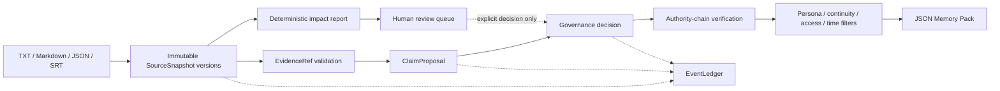

# ContinuityForge

**Compile source texts into provenance-aware, timeline-safe memory packs for long-lived AI personas.**

ContinuityForge is a local, dependency-light compiler above RAG and memory stores. It turns novels, scripts, lore, transcripts, subtitles, and structured notes into governed claims whose source lines, continuity, persona scope, access policy, and knowledge time remain inspectable.

> 中文简介：ContinuityForge 将小说、剧本、设定与记录编译成可追溯原文、隔离世界线、受角色知晓时间约束的 AI 人格记忆包。它是记忆系统上游的来源治理与编译层，不是聊天前端或向量数据库。

## Status

- **v0.1:** frozen observable compatibility baseline.
- **v0.2.0:** current stable CLI, SQLite, governance, ledger, and Memory Pack workflow.
- **v0.3.0a4:** current alpha pre-release under the accepted [owner decisions](docs/V0_3_DECISIONS.md), focused on SourceSnapshot revision impact, authority-chain integrity, strict migration, backup-gated upgrade, and read-only inspection.

The v0.1 and v0.2 contracts remain intact in the v0.3.0a4 alpha pre-release.
The documented v0.3 command, stream, exit-code, and machine-report contracts
are frozen and tested, but remain pre-release interfaces until stable v0.3.

## What ContinuityForge guarantees

Stable v0.2 behavior provides:

- immutable, SHA-256-addressed `SourceSnapshot` revisions;
- 1-based, inclusive, exact-line evidence spans;
- exact persona and continuity isolation;
- separate world-validity and persona-knowledge intervals;
- explicit `MemoryCutoff` compilation;
- fail-closed `agent_accessible`, `human_only`, and `hidden` access handling;
- an LLM-proposes-only boundary—model confidence never grants authority;
- explicit `AUTHORIZED`, `REJECTED`, and `DISPUTED` governance decisions;
- an append-only, hash-linked EventLedger;
- JSON Memory Packs retaining claim and evidence provenance;
- zero third-party runtime dependencies.

The v0.3.0a4 alpha pre-release strengthens those guarantees with:

- strict built-in-integer evidence coordinates;
- bounded, control-aware source ingestion;
- strict, bounded JSON for operator-authored event details;
- claim authority-chain and narrative-event audit replay before compilation;
- one pinned SQLite read snapshot for each Memory Pack compilation;
- deterministic, exact SourceSnapshot impact classification;
- bounded, hash-bound, storage-aware impact inspection with ledger, claim-authority, and affected-event audit replay;
- strict schema recognition and read-only migration preflight;
- transactional, schema-fingerprinted, backup-gated v0.1/v0.2 to v0.3 migration;
- private, collision-safe backup publication that never overwrites an existing artifact;
- explicit CLI database lifecycles with no ordinary-command implicit migration;
- functional v0.1 quarantine that preserves bad rows without mapping them into active authority;
- Audit Material v2 digests that bind every persisted Claim, NarrativeEvent, and Evidence field used by trusted reads;
- a fail-closed legacy-material gate requiring explicit operator acceptance for admitted partial creation records and empty v0.2 Claim/Event audit streams;
- a final SQLite material guard that admits only canonical creation, evidence-checkpoint, and six-key attestation payloads;
- canonical-path coverage ingestion and line-ending-aware v0.1 baseline-lock verification.

The alpha currently passes the complete regression suite. Its v0.3 machine
outputs are frozen by the [CLI contract](docs/CLI_CONTRACT.md) and the bundled
JSON Schemas. See [Migration v3](docs/MIGRATION_V3.md) and [Snapshot
Impact](docs/SNAPSHOT_IMPACT.md).

## What ContinuityForge does not guarantee

ContinuityForge does **not**:

- decide whether a narrative assertion is true merely because text is similar;
- grant authority to LLM output, model confidence, or a provider name;
- protect against an operating-system user who can replace the entire SQLite database;
- provide a signed external checkpoint, encrypted database, or encrypted backup;
- provide a one-command restore or deployment activation mechanism;
- infer that two arbitrary snapshots share source/continuity lineage in the two-argument Impact API;
- create `NarrativeEvent` values from model output;
- automatically move an affected `AUTHORIZED` claim to `DISPUTED`;
- perform fuzzy, semantic, case-folded, whitespace-folded, or Unicode-normalized impact matching;
- expose an HTTP, MCP, OpenAI-compatible, or hosted multi-user service.

## Trust boundary

The operating-system account and SQLite file owner are trusted. ContinuityForge defends against malformed source input, untrusted model proposals, ordinary integration mistakes, and application defects. An attacker who can replace both the database and its internal ledger is outside the v0.3 trust boundary; detecting that requires an external signed checkpoint.

`NarrativeEvent` is **operator-only**. Models must produce `ClaimProposal` values, which pass evidence validation and governance review. There is no implicit EventProposal lifecycle.

Snapshot impact is **report-only**. A new source version can produce an impact report, but only an explicit reviewer action may change a claim to `DISPUTED`.

### Source-body disclosure

v0.3.0a4 administrative report surfaces are metadata-first: impact and migration reports default to IDs, versions, hashes, line spans, statuses, counts, and error codes—not complete `SourceSnapshot.content` bodies. Explicit evidence operations and compiled Memory Packs may include the cited quote span as provenance. Treat those exports, database access, and migration backup files as disclosure boundaries.

## Architecture at a glance



Read [Architecture](docs/ARCHITECTURE.md), [Data Model](docs/DATA_MODEL.md), and [Threat Model](docs/THREAT_MODEL.md) for the full boundaries.

## Quick start: stable v0.2 CLI

Requirements: Python 3.10 or newer.

```bash
python -m venv .venv
python -m pip install -e .
continuityforge demo --output-dir demo-output --reset
```

Run the regression suite:

```bash
python -m pip install -e ".[dev]"
python -m pytest
```

### End-to-end governed claim

```bash
# 1. Import one immutable source version.
continuityforge --db forge.db ingest examples/alpha.txt \
  --continuity alpha \
  --source-key alpha-field-log

# 2. Submit a non-authoritative proposal. Replace SNAPSHOT_ID with ingest output.
continuityforge --db forge.db claim-propose \
  --persona mira \
  --continuity alpha \
  --claim "The compass is sealed inside Locker Seven." \
  --subject compass \
  --predicate stored_in \
  --object locker-seven \
  --evidence SNAPSHOT_ID:4:4 \
  --knowledge-from 2026-01-01T18:00:00Z \
  --provider local \
  --model example-model

# 3. Replace CLAIM_ID with proposal output, then record human review.
continuityforge --db forge.db claim-review CLAIM_ID \
  --status authorized \
  --reviewer maintainer \
  --reason "Line 4 directly supports the claim."

# 4. Validate and compile at an explicit knowledge cutoff.
continuityforge --db forge.db validate
continuityforge --db forge.db ledger-verify
continuityforge --db forge.db compile \
  --persona mira \
  --continuity alpha \
  --cutoff 2026-01-02T00:00:00Z \
  -o memory-pack.alpha.2026-01-02.json
```

`--cutoff` filters knowledge time. Valid-time filtering is independent and activates only when `--valid-at` is supplied.

## Stable v0.2 command map

| Command | Stable purpose |
|---|---|
| `ingest` | Import `.txt`, `.md`, `.markdown`, `.json`, or `.srt` as an immutable source version. |
| `source-list` | List logical sources, optionally scoped to one continuity. |
| `claim-propose` | Store model or tool output as `PROPOSED`; never authorize it. |
| `claim-review` | Record an explicit `authorized`, `rejected`, or `disputed` decision. |
| `claim-add` | Compatibility path for an evidence-backed human claim. |
| `claim-list` | Inspect claim proposals by scope or status. |
| `event-add` | Add an evidence-backed, human/operator-supplied narrative event. |
| `validate` | Check source, evidence, temporal, governance, conflict, and ledger invariants. |
| `compile` | Emit a scoped JSON Memory Pack at a knowledge cutoff. |
| `ledger-verify` | Recompute and verify the EventLedger hash chain. |
| `ledger-show` | Print ordered ledger metadata. |
| `demo` | Run the synthetic Alpha/Beta isolation and future-knowledge scenario. |

Use `continuityforge COMMAND --help` for stable v0.2 options.

## v0.3.0a4 database lifecycle

Every command now declares how it may interact with the database path:

| Lifecycle | Commands | Behavior |
|---|---|---|
| Create-capable | `ingest`, `demo` | May create a new schema-v3 database. An existing legacy database is not migrated implicitly. |
| Write-existing | `claim-propose`, `claim-add`, `claim-review`, `event-add` | Require an existing schema-v3 database. |
| Read-existing | `source-list`, `claim-list`, `validate`, `compile`, `ledger-verify`, `ledger-show`, `source-impact`, `migration-check` | Require an existing database and do not create a database, parent directory, or backup. Ordinary read commands require schema v3; migration inspection remains explicit. |
| Explicit migration | `migrate` | Is the only CLI lifecycle permitted to upgrade an existing v0.1/v0.2 database. |

A missing existing-database target fails with `DATABASE_NOT_FOUND` and no filesystem side effects. An ordinary command aimed at a recognized legacy database fails closed instead of constructing writable `Storage`; run `migration-check`, then `migrate` explicitly.

## v0.3.0a4 alpha pre-release CLI

These commands are executable in the v0.3.0a4 alpha pre-release. Their flags, streams,
exit codes, and JSON report shapes are tested against the formal
[v0.3 machine contract](docs/CLI_CONTRACT.md).

| Alpha command | Contract |
|---|---|
| `source-impact` | Open an existing database read-only and emit a `continuityforge.source-impact/v0.3` metadata-only summary for claim/event evidence; no governance mutation. |
| `migration-check` | Inspect an existing database without creating a database, backup, schema object, or write transaction. |
| `migrate` | Require an existing database, create and verify a consistent backup, then run a transactional v0.1/v0.2 to v0.3 migration. |

```bash
# Compare v1 evidence with v2, or omit --target-version for latest.
continuityforge --db project.db source-impact \
  --source-key north-pier-field-log \
  --continuity alpha \
  --from-version 1 \
  --target-version 2

# Strict, read-only eligibility check. This command never creates a backup.
continuityforge --db project.db migration-check --mode strict

# Explicit write operation. This refuses a missing database and is backup-gated.
continuityforge --db project.db migrate --mode strict

# Only when preflight reports MIGRATION_LEGACY_MATERIAL_ATTESTATION_REQUIRED:
continuityforge --db project.db migration-check --mode strict \
  --attest-current-legacy-material
continuityforge --db project.db migrate --mode strict \
  --attest-current-legacy-material
```

`source-impact` also accepts `--source-id` instead of `--source-key`, and `--to-version` is an alias for `--target-version`. Both migration commands accept `--mode strict|quarantine`; quarantine only isolates malformed v0.1 rows and malformed v0.2 data remains a blocking error.

`--attest-current-legacy-material` is a deliberate operator acceptance of the current complete Claim/Event/Evidence material when an admitted legacy creation payload did not bind it or a v0.2 Claim/Event audit stream is empty. Canonical v0.1 conversion deterministically creates Material-v2 creation records and needs no opt-in. An eligible empty v0.2 stream requires the flag, but migration generates a Material-v2 creation record rather than an attestation event, so its `MigrationReport.attestations` Claim/Event count remains zero. Existing partial legacy creation records instead receive bound attestation events.

`migration-check --attest-current-legacy-material` remains read-only and may report `is_ready: true` without creating a backup. A write migration that needs this acceptance must first create and verify its backup, then perform the creation backfill or attestation inside `BEGIN IMMEDIATE`; a library migration configured without backup fails with `MIGRATION_MATERIAL_ATTESTATION_REQUIRES_BACKUP`. The acceptance proves what was accepted at migration time, not what a historical creation payload contained, and a pre-existing legacy attestation never substitutes for consent on the current invocation.

No restore CLI is included in v0.3.0a4; follow [Backup and Restore](docs/BACKUP_AND_RESTORE.md) for staged operator recovery.

Affected event evidence is admitted to an impact report only after the complete bounded event batch is replayed against its creation ledger material inside the same pinned read transaction. A mismatch fails closed with `EVENT_AUDIT_INVALID`; inspection does not downgrade the event to an unaudited anchor.

## Deterministic Impact API

The v0.3.0a4 pure-domain Impact engine is available to library callers in the alpha pre-release:

```python
from continuityforge.impact import analyze_evidence_impact

report = analyze_evidence_impact(old_evidence, resolved_target_snapshot)
print(report.outcome.value)
print(report.candidate_spans)
```

Outcomes are `SAME_POSITION`, `EXACT_MOVED_UNIQUE`, `EXACT_MOVED_AMBIGUOUS`, `NO_EXACT_MATCH`, and `INVALID_EVIDENCE`. The engine normalizes line separators only, preserves all semantic whitespace, returns candidates in stable source order, and does not access SQLite or change governance. The caller must establish source and continuity lineage first.

See [Snapshot Impact](docs/SNAPSHOT_IMPACT.md).

## North Pier revision demo

The fully original [North Pier demo](examples/north_pier/README.md) contains v1/v2 source fixtures and expected deterministic outcomes for unchanged, uniquely moved, ambiguously repeated, and no-longer-exactly-present evidence. `NO_EXACT_MATCH` never claims whether the cause was editing, deletion, truncation, or restructuring.

```bash
python examples/north_pier/run_demo.py --output-dir demo-output/north-pier --reset
```

The package-API script creates three authorized claim anchors plus one operator-event anchor, imports both revisions, verifies all four non-error impact outcomes, and writes a metadata-only JSON report.

Stable v0.2 ingestion can import both versions:

```bash
continuityforge --db north-pier.db ingest examples/north_pier/north_pier_v1.txt \
  --continuity alpha --source-key north-pier-field-log
continuityforge --db north-pier.db ingest examples/north_pier/north_pier_v2.txt \
  --continuity alpha --source-key north-pier-field-log
```

The v0.3.0a4 alpha pre-release can inspect the imported revisions with the
`source-impact` syntax above. The report is metadata-only and follows the
formal `continuityforge.source-impact/v0.3` schema. Demo data licensing is
documented in [Demo Licenses](docs/DEMO_LICENSES.md).

## Documentation

| Document | Purpose |
|---|---|
| [v0.1 baseline](docs/V0_1_BASELINE.md) | Frozen observable compatibility contract. |
| [v0.2 design](docs/V0_2_DESIGN.md) | Versioned sources, evidence, governance, ledger, and compiler design. |
| [v0.3 decisions](docs/V0_3_DECISIONS.md) | Accepted owner trust and product boundaries. |
| [CLI contract](docs/CLI_CONTRACT.md) | Frozen JSON schemas, streams, exit codes, and ordering rules. |
| [Architecture](docs/ARCHITECTURE.md) | Components, flows, and dependency rules. |
| [Data Model](docs/DATA_MODEL.md) | Entities, scopes, time, access, and report shapes. |
| [Threat Model](docs/THREAT_MODEL.md) | Assets, attackers, mitigations, and residual risks. |
| [Deterministic vs LLM](docs/DETERMINISTIC_VS_LLM.md) | Which decisions may use a model and which may not. |
| [Snapshot Impact](docs/SNAPSHOT_IMPACT.md) | Exact matching semantics and review workflow. |
| [Migration v3](docs/MIGRATION_V3.md) | Strict migration contract and status. |
| [Backup and Restore](docs/BACKUP_AND_RESTORE.md) | Consistent backup and restoration requirements. |
| [Security Testing](docs/SECURITY_TESTING.md) | Adversarial test matrix and commands. |
| [Demo Licenses](docs/DEMO_LICENSES.md) | Provenance and licensing for bundled fixtures. |

## Development

```bash
python -m pip install -e ".[dev]"
python -m pytest
continuityforge demo --output-dir demo-output --reset
```

The semantic contract, legacy schema fixture, and v0.1 baseline document are SHA-256 locked. Never update that lock to hide an accidental change. Any intentional compatibility change requires an explicit versioned migration, contract update, release note, and review.

See [CONTRIBUTING.md](CONTRIBUTING.md), [SECURITY.md](SECURITY.md), and the [Code of Conduct](CODE_OF_CONDUCT.md).

## License

Code and repository documentation are licensed under [MIT](LICENSE). The original North Pier demo fixtures are dedicated under CC0-1.0; see [LICENSES/NORTH_PIER_DEMO.md](LICENSES/NORTH_PIER_DEMO.md).
