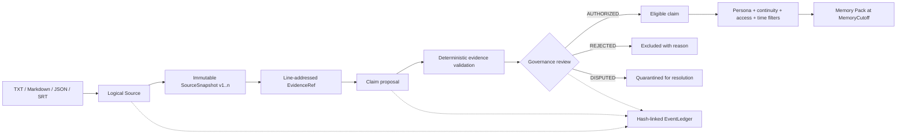

# ContinuityForge

**Compile source texts into provenance-aware, timeline-safe memory packs for long-lived AI personas.**

ContinuityForge sits *above* memory stores and RAG systems. It turns source material—novels, scripts, lore, transcripts, subtitles, and structured notes—into governed claims that remain traceable to exact source lines, isolated by continuity, and filtered by what a persona could know at a given `MemoryCutoff`.

> 中文简介：ContinuityForge 将小说、剧本、设定与聊天记录编译成可追溯原文、隔离世界线、受角色知晓时间约束的 AI 人格记忆包。它是 AI memory systems 上游的来源治理与编译层，而不是聊天前端或向量数据库。

## Why this exists

Long-lived personas fail in ways that similarity search alone does not solve:

- a retrieved statement has no inspectable source;
- facts from alternate continuities leak into one another;
- a character knows something before learning it;
- human-only notes reach an agent prompt;
- a model-generated interpretation becomes “canon” without review;
- edited source material silently changes the meaning of old citations.

ContinuityForge treats those as data-integrity problems. Its v0.2 pipeline makes source versions immutable, validates line-level evidence, keeps LLM output at proposal authority, records governance decisions, and emits only claims allowed by the requested persona, continuity, access policy, and cutoff.

## Current status: v0.2

The v0.1 baseline is a frozen behavioral contract, not disposable scaffolding. v0.2 adds capabilities without silently weakening the original guarantees.

| Guarantee | v0.1 baseline | v0.2 |
|---|:---:|:---:|
| TXT / Markdown / JSON / SRT ingestion | ✓ | ✓ |
| SHA-256 source identity and exact line spans | ✓ | ✓ |
| Persona and continuity isolation | ✓ | ✓ |
| Valid-time and knowledge-time filtering | ✓ | ✓ |
| `MemoryCutoff` compilation | ✓ | ✓ |
| `agent_accessible` / `human_only` / `hidden` access | ✓ | ✓ |
| SQLite persistence and CLI workflow | ✓ | ✓ |
| Immutable, ordered `SourceSnapshot` versions |  | ✓ |
| Evidence quote/hash verification |  | ✓ |
| LLM-proposes-only trust boundary |  | ✓ |
| `AUTHORIZED` / `REJECTED` / `DISPUTED` governance |  | ✓ |
| Append-only, hash-linked `EventLedger` |  | ✓ |

See [the v0.1 baseline contract](docs/V0_1_BASELINE.md) and [the v0.2 design](docs/V0_2_DESIGN.md).

## How it works



The key trust boundary is deliberate:

```text
LLM output -> proposal -> evidence validation -> governance -> compilation
                                      ^
                         never direct canon writes
```

## Quick start

Requirements: Python 3.10 or newer. Runtime dependencies: none outside the Python standard library.

```bash
python -m venv .venv
python -m pip install -e .
continuityforge demo --output-dir demo-output --reset
```

The demo creates an isolated SQLite database, ingests synthetic Alpha/Beta sources, exercises governed claim creation and ledger verification, and writes a cutoff-specific memory pack under `demo-output/`.

Run the regression suite:

```bash
python -m pip install -e ".[dev]"
python -m pytest
```

## End-to-end CLI workflow

All commands accept a shared SQLite database through `--db`:

```bash
# 1. Ingest an immutable snapshot in one continuity.
continuityforge --db forge.db ingest examples/alpha.txt \
  --continuity alpha \
  --source-key north-pier-log

# 2. Submit a claim proposal. SNAPSHOT_ID is printed by ingest.
continuityforge --db forge.db claim-propose \
  --persona mira \
  --continuity alpha \
  --claim "The compass is sealed inside Locker Seven." \
  --subject compass \
  --predicate stored_in \
  --object locker-seven \
  --evidence SNAPSHOT_ID:4:4 \
  --knowledge-from 2026-01-01T18:00:00Z \
  --provider local \
  --model example-model

# 3. Review the validated proposal. CLAIM_ID is printed by claim-propose.
continuityforge --db forge.db claim-review CLAIM_ID \
  --status authorized \
  --reviewer maintainer \
  --reason "Line 4 directly supports the claim."

# 4. Validate all stored invariants and the ledger chain.
continuityforge --db forge.db validate
continuityforge --db forge.db ledger-verify

# 5. Compile only memories Mira may access and know at the cutoff.
continuityforge --db forge.db compile \
  --persona mira \
  --continuity alpha \
  --cutoff 2026-01-02T00:00:00Z \
  -o memory-pack.alpha.2026-01-02.json
```

The January 2 pack can include the line-4 locker fact, but it must exclude the archive code learned on January 3 and every Beta-continuity claim.

### Evidence coordinates

`--evidence SNAPSHOT_ID:START_LINE:END_LINE` is repeatable. Lines are **1-based** and the end line is **inclusive**. A stored evidence reference contains:

```json
{
  "snapshot_id": "SNAPSHOT_ID",
  "start_line": 4,
  "end_line": 4,
  "quote": "At sunset, Rowan sealed the compass inside Locker Seven.",
  "content_hash": "SHA256_OF_NORMALIZED_QUOTE"
}
```

Multi-line evidence is normalized with `\n` between source lines before hashing. Validation fails if the snapshot is missing, the range is invalid, the continuities differ, or a supplied quote/hash no longer matches the immutable snapshot.

## Command map

| Command | Purpose |
|---|---|
| `ingest` | Import `.txt`, `.md`, `.markdown`, `.json`, or `.srt` as an immutable source version. |
| `source-list` | List logical sources, optionally scoped to one continuity. |
| `claim-propose` | Store a model or tool suggestion as a non-authoritative claim proposal. |
| `claim-review` | Record an `authorized`, `rejected`, or `disputed` governance decision and reason. |
| `claim-add` | Compatibility path for a human-authored claim; validate evidence and authorize it atomically. |
| `claim-list` | Inspect proposals, optionally filtered by scope or governance status. |
| `event-add` | Append a source-backed narrative event without mutating prior history. |
| `validate` | Check source, evidence, continuity, temporal, governance, and conflict invariants; add `--json` or `--strict-proposals`. |
| `compile` | Emit a JSON Memory Pack for one persona, continuity, and `MemoryCutoff`; optionally set `--valid-at`. |
| `ledger-verify` | Recompute the append-only ledger chain and report tampering or corruption. |
| `ledger-show` | Print ordered ledger entries for inspection. |
| `demo` | Run the bundled Alpha/Beta isolation and future-knowledge scenario; `--reset` recreates its database. |

Use `continuityforge COMMAND --help` for the complete option list.

`event-add` creates a human/operator-supplied, evidence-linked narrative event; `EventLedger` is the separate audit hash chain that records mutations. Model-extracted assertions should use `claim-propose`, not `event-add`, so they pass through evidence and governance.

## Source versioning

`source_key + continuity` identifies a logical source. Ingestion never overwrites bytes:

- re-importing the current content is idempotent;
- changed content creates the next immutable `SourceSnapshot` version;
- each snapshot retains its own SHA-256 content identity and line count;
- evidence remains anchored to the exact historical snapshot it cited;
- “latest source” and “valid evidence” are separate questions.

This lets maintainers add revised canon without rewriting history or invalidating the audit trail silently.

## Governance semantics

An LLM may extract, summarize, and propose. It does not grant authority.

| Status | Compiler behavior | Meaning |
|---|---|---|
| `AUTHORIZED` | Eligible after all other filters pass | Evidence and policy review allow use as persona memory. |
| `REJECTED` | Excluded | The proposal is unsupported, malformed, out of scope, or intentionally declined. |
| `DISPUTED` | Excluded | Competing evidence or interpretation needs explicit resolution. |

A review records the reviewer, reason, timestamp, and ledger event. Status is not inferred from model confidence.

## Memory Pack selection

Compilation is fail-closed. A claim is emitted only when all required conditions hold:

1. governance status is `AUTHORIZED`;
2. every required evidence reference is valid;
3. `persona_id` and `continuity` exactly match the compile request;
4. the persona's knowledge-time interval includes the `MemoryCutoff`;
5. when `--valid-at` is supplied, that instant is within the claim's valid-time interval;
6. access is `agent_accessible`;
7. no unresolved validation error makes the claim ineligible.

The JSON output retains claim IDs and source spans so downstream memory systems can display or audit provenance instead of receiving opaque text.

## Using ContinuityForge with an LLM

Keep generation outside the trusted core. Ask a model to return structured proposals compatible with [examples/proposals.json](examples/proposals.json), then submit each proposal through `claim-propose`. The deterministic validator and governance layer—not the model—decide whether a proposal can become eligible memory.

ContinuityForge intentionally has no runtime SDK dependency on a model provider. OpenAI, local models, batch extractors, or hand-written tools can all produce proposals.

## Development

```bash
python -m pip install -e ".[dev]"
python -m pytest
continuityforge demo --output-dir demo-output --reset
```

Compatibility rule: a change that weakens a documented v0.1 guarantee must include an explicit versioned migration, regression-test update, and release note. It must never arrive as an unannounced behavior change.

The semantic contract, legacy schema fixture, and baseline document are SHA-256 locked by `tests/baseline/v01_baseline.lock.json`; CI fails if they change without an explicit lock update visible in review.

## Project layout

```text
ContinuityForge/
├── src/continuityforge/    # models, storage, validation, compiler, CLI
├── tests/baseline/         # frozen v0.1 behavioral contract
├── tests/v02/              # v0.2 feature and governance tests
├── examples/               # original Alpha/Beta fixtures and proposals
├── docs/V0_1_BASELINE.md   # compatibility contract
└── docs/V0_2_DESIGN.md     # architecture and invariants
```

## License

[MIT](LICENSE)
