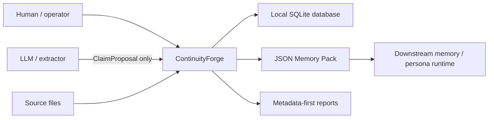
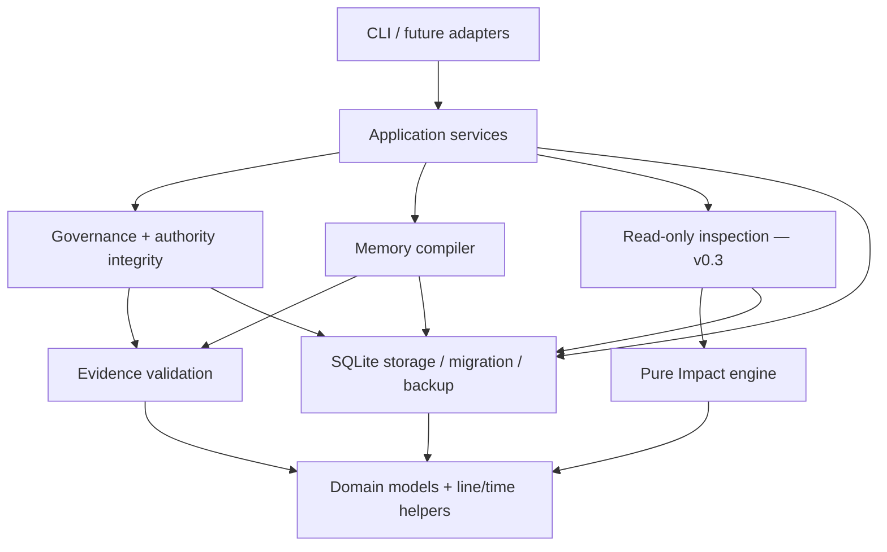
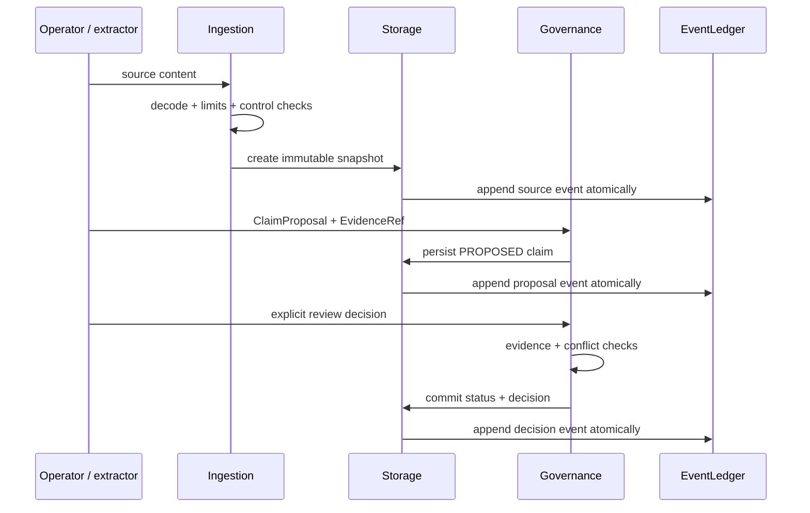
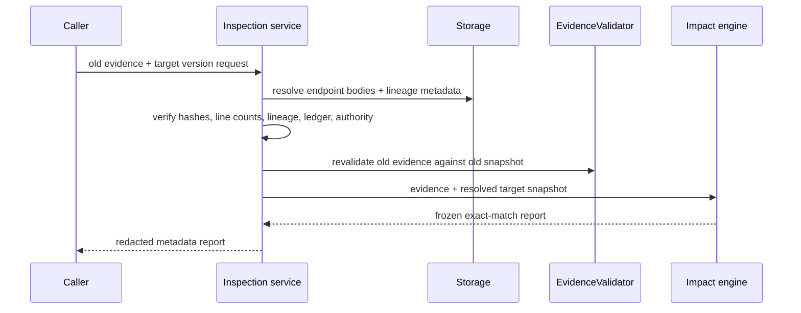

# ContinuityForge Architecture

## Status vocabulary

- **Released:** available in v0.2.0.
- **Implemented, unreleased:** present in the v0.3.0a1 development code and tests.
- **Accepted contract:** approved in [V0_3_DECISIONS.md](V0_3_DECISIONS.md); integration may still be in progress.
- **Deferred:** intentionally outside v0.3.0a1.

## System context

ContinuityForge is a local compiler and governance layer between source material and downstream persona-memory systems.

It does not provide a chat interface, vector database, hosted service, HTTP transport, or model-provider SDK.

## Architectural goals

1. Preserve exact source provenance.
2. Keep persona and continuity boundaries explicit.
3. Separate world-validity time from persona-knowledge time.
4. Make model output non-authoritative by construction.
5. Fail closed when evidence, governance, migration, or authority history is malformed.
6. Keep trusted decisions deterministic and offline-testable.
7. Preserve v0.1/v0.2 observable behavior while adding v0.3 inspection.
8. Avoid complete source-body disclosure in administrative reports by default.

## Component layers

### Domain values

`models.py`, `impact_models.py`, and shared line/time helpers define IDs, intervals, access policies, evidence spans, and frozen reports. They do not open a database or call a model.

### Ingestion and evidence

Ingestion decodes supported text formats, preserves decoded content, applies configured resource/control policies, and asks storage to create an immutable snapshot. Evidence validation verifies strict coordinates, snapshot existence, continuity, quote text, and optional quote hash.

### Pure Impact engine

The Impact engine accepts an old `EvidenceRef` value and an already-resolved target `SourceSnapshot`. It performs exact continuous-line matching using deterministic KMP search and returns a frozen report. It has no SQLite, CLI, or LLM dependency.

Because `EvidenceRef` does not carry logical-source lineage, this two-value engine does not prove that the target belongs to the same source or continuity. A storage-aware inspection service must establish that boundary first.

### Governance and authority integrity

Governance records explicit status transitions. Authorization rechecks evidence and deterministic conflicts. v0.3 authority integrity verifies that an `AUTHORIZED` materialized status is backed by a complete decision, evidence-set, and ledger chain before compilation. Operator-authored `NarrativeEvent` rows and their evidence sets are likewise bound to exactly one creation ledger record.

### SQLite storage

Storage owns transactions, immutable-row triggers, version allocation, evidence persistence, governance decisions, narrative events, legacy records, and the database-wide EventLedger. Schema-v3 migration and its verified backup gate operate at this boundary.

### Compiler

The compiler reads only eligible, authorized values and applies exact persona, continuity, access, knowledge-time, optional valid-time, evidence, authority-chain, and event-audit filters. All reads for one compilation run inside a pinned SQLite snapshot, preventing a concurrent review from mixing old authority with new evidence. It never asks an LLM to fill missing data.

### CLI and adapters

The v0.2 CLI is released. The development tree also implements the unreleased `source-impact`, `migration-check`, and `migrate` alpha commands. They are tested but must not be treated as stable automation interfaces before v0.3 release. Restore and deployment activation remain operator workflows.

## Write path

`NarrativeEvent` follows a separate operator-only write path and requires evidence. Model extraction must use `ClaimProposal`.

## Read and inspection path

Impact is report-only. The inspection path has no authority to change claim status. A human may later submit an explicit governance decision.

## Core invariants

| Invariant | Enforced by |
|---|---|
| A snapshot's content and version identity do not mutate | Storage transactions and immutable-row triggers |
| Evidence lines are built-in integers, 1-based, inclusive | Evidence domain validation |
| Evidence and claim continuity match exactly | Evidence validation |
| LLM output cannot set authoritative status | Governance proposal boundary |
| `AUTHORIZED` requires evidence/conflict checks | Governance service |
| Materialized authority has decision/evidence/ledger backing | v0.3 authority integrity |
| Operator event and evidence have one matching audit record | v0.3 event integrity |
| One compile/inspection never mixes concurrent database states | Pinned read transactions |
| `human_only` does not enter default agent packs | Compiler access filter |
| Future knowledge does not enter an earlier cutoff | Compiler knowledge-time filter |
| Impact never mutates governance | Impact/inspection architecture |
| Migration cannot broaden malformed legacy authority/access | Schema-v3 fail-closed contract |

## Time model

All intervals use `[from, to)` semantics. Knowledge time controls what a persona may know. Valid time controls when a fact holds in the represented world. The CLI's knowledge cutoff does not implicitly activate valid-time filtering; callers request `valid_at` separately.

## Report and disclosure model

Administrative reports default to metadata:

- IDs and versions;
- hashes and fingerprints;
- line spans and candidate counts;
- governance/access status;
- stable reason and error codes;
- migration/backup verification results.

Complete `SourceSnapshot.content` is excluded by default. Evidence-specific APIs and Memory Packs may intentionally include cited quotes. Backup artifacts contain the database and therefore all stored content.

## Compatibility architecture

- The v0.1 baseline is byte-locked and exercised on every supported platform.
- v0.2 compatibility aliases and Memory Pack fields remain available.
- Schema changes require transactional migration and preservation of immutable provenance.
- v0.3 impact reports are additive and do not reinterpret existing claim status.

## Extension rules

Future HTTP, MCP, provider, vector-store, or UI adapters must remain outside the deterministic core. They may orchestrate existing services but must not:

- write `AUTHORIZED` directly;
- bypass evidence or authority-chain checks;
- construct operator-only events from model output;
- turn semantic similarity into deterministic impact status;
- dump source bodies through an administrative endpoint by default.

See [Deterministic vs LLM](DETERMINISTIC_VS_LLM.md), [Data Model](DATA_MODEL.md), and [Threat Model](THREAT_MODEL.md).
