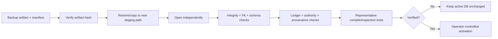

# Backup and Restore

## Status

The v0.3.0a4 alpha pre-release `migrate` command implements a mandatory, consistent, verified pre-migration backup. `migration-check` is strictly read-only and never creates a backup. Restore, activation, retention, and external encryption remain operator workflows; there is no restore CLI.

```bash
continuityforge --db project.db migration-check --mode strict
continuityforge --db project.db migrate --mode strict

# Conditional: only after the default preflight requires legacy-material consent.
continuityforge --db project.db migration-check --mode strict \
  --attest-current-legacy-material
continuityforge --db project.db migrate --mode strict \
  --attest-current-legacy-material
```

## Why ordinary file copying is insufficient

SQLite may use a write-ahead log. Copying only `project.db` while the database is live can omit committed WAL pages or capture an inconsistent state. ContinuityForge backup operations must use SQLite's consistent backup mechanism or operate on a verified, fully closed database set.

## Backup contract

A migration-grade backup must:

1. be created before any schema-v3 mutation;
2. represent one consistent SQLite state;
3. be written to a new artifact, never over the source database;
4. be independently openable;
5. pass SQLite integrity and foreign-key checks;
6. retain the detected schema version and database identity/fingerprint;
7. have a SHA-256 recorded after close;
8. emit metadata without embedding source bodies;
9. be published without replacing any existing path or following a symbolic-link target;
10. remain available until migration and restoration verification complete;
11. precede any legacy material-attestation or final material-trigger write.

The v0.3.0a4 implementation builds the SQLite backup in an unpredictable same-directory temporary file, tracks the file identity, verifies it is still a regular file before any backup page is written, flushes it, and publishes the verified artifact without replacement. It also compares a streamed logical-database digest from the locked source connection with the independently reopened backup, so a same-schema path replacement cannot be published as the source backup. Existing backup names are preserved and a numbered name is selected. A symbolic-link candidate fails closed rather than being followed. On POSIX, the temporary and published artifact must retain mode `0600`; on Windows, the process applies the platform file mode and the operator must also protect the containing directory and ACL.

## Migration backup metadata

`MigrationReport` binds the backup path and SHA-256 to the source structural
fingerprint and migration checks. Formal v0.3 output contains metadata similar
to:

```json
{
  "schema": "continuityforge.migration-report/v0.3",
  "source": {
    "kind": "v0.2",
    "digest": "STRUCTURAL_SCHEMA_SHA256",
    "user_version": 2,
    "metadata_version": 2
  },
  "checks": {
    "quick_check": "ok",
    "foreign_key_violations": 0,
    "database_bytes": 123456,
    "backup_path": "project.db.pre-v3.bak",
    "backup_sha256": "BACKUP_SHA256"
  },
  "status": "migrated",
  "attestations": {"material_version": 2, "claims": 3, "events": 1}
}
```

The full JSON also contains schema object lists, capacity checks, target
fingerprint, timestamps, migrated counts, issues, `attestations`, and quarantine
records. Its Claim/Event attestation counts reflect appended attestation events:
an accepted empty v0.2 creation backfill therefore reports zero. Its
exact shape is frozen by the [v0.3 CLI contract](CLI_CONTRACT.md). The backup
filename is collision-safe: later runs use `.pre-v3.2.bak`, `.pre-v3.3.bak`,
and so on rather than overwriting an existing artifact. Backup creation and
verification complete before the migration transaction begins.

When `--attest-current-legacy-material` is required, the backup is therefore a
copy of the still-unmodified legacy database. Only after that artifact is
independently verified does the write path enter `BEGIN IMMEDIATE`, generate
Material-v2 creation records for accepted empty v0.2 Claim/Event streams and/or
append bound attestations for existing partial creation records, install the
final guard, and run post-verification. The acceptance states which current
complete material the operator accepted; it is not evidence of historical
truth.

`migration-check --attest-current-legacy-material` deliberately runs with
backup creation disabled and may report `is_ready: true`: it validates a
read-only plan, not permission to write without recovery evidence. A library
write migration configured with `create_backup=False` fails before any accepted
backfill or attestation with `MIGRATION_MATERIAL_ATTESTATION_REQUIRES_BACKUP`.
Canonical v0.1 conversion is deterministic and does not use this consent gate.

## Confidentiality

The report is metadata-first; the backup artifact is not. A backup contains source bodies, evidence quotes, claims, events, and governance history.

- retain the restrictive permissions created by the migration path and protect the containing directory/ACL;
- use operating-system or external encryption when required;
- do not attach it to a public issue;
- do not log its source content;
- define retention and secure deletion outside ContinuityForge.

ContinuityForge does not currently provide encryption, key management, ACL administration, or secure deletion.

## Restore-before-activate workflow

Never restore directly over the only known-good database.



Activation may be an atomic rename or deployment-specific pointer switch, but it remains outside an open SQLite connection. Resolve absolute paths and retain the previous active database until the new one is verified.

## Restore verification checklist

- artifact SHA-256 matches the manifest;
- restored file opens read-only and read-write as intended;
- `PRAGMA integrity_check` succeeds;
- foreign-key checks succeed;
- detected schema matches expectation;
- source/snapshot/evidence counts match the manifest or migration report;
- snapshot and evidence hashes validate;
- EventLedger verifies;
- authority-chain and Audit Material v2 replay succeed;
- report `attestations` counts agree with the migrated ledger when present;
- `human_only`/`hidden` access remains non-exportable by default;
- representative pre/post-cutoff Memory Packs behave as expected;
- read-only impact/inspection reports do not mutate the database;
- complete source bodies remain absent from administrative report output.

## Recovery scenarios

### Migration transaction fails

The transaction should roll back. Re-run read-only preflight against the original database and compare its fingerprint to the pre-migration report.

### Post-migration checks fail

Do not activate the candidate. Restore the verified backup to a new path and validate it independently.

### Active database is accidentally replaced

Stop writers, preserve the failed file for audit, restore to a staging path, validate, then activate. Internal EventLedger verification cannot prove identity against an attacker who replaced the entire database; compare an external backup manifest or signed checkpoint where available.

### Backup hash fails

Treat the artifact as unusable. Create a new consistent backup from a verified source database rather than ignoring or rewriting the recorded hash.

## Operational ownership

The operator is responsible for storage location, file permissions, external encryption, retention, off-site replication, restoration, and activation. The v0.3.0a4 migration path creates and verifies the backup artifact and returns machine-readable path/hash evidence, but it does not copy backups off-site or perform activation.

See [Migration v3](MIGRATION_V3.md) and [Threat Model](THREAT_MODEL.md).
