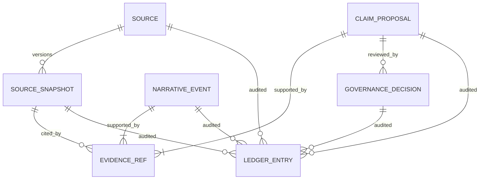
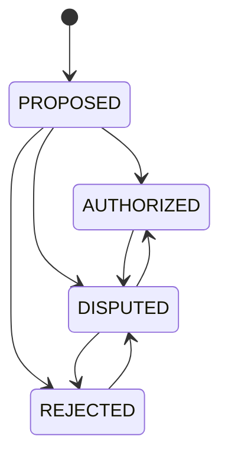

# ContinuityForge Data Model

## Scope and versions

- v0.1 defines the frozen observable baseline.
- v0.2 introduces logical sources, immutable versions, proposal governance, narrative events, and EventLedger.
- v0.3 adds stricter authority/migration invariants and read-only impact/inspection reports without changing snapshot history automatically.

Schema version 3 and the inspection/migration domain reports are implemented in the unreleased v0.3.0a3 development tree. Report values are transient and need not be persisted.

## Entity overview



## `Source`

A stable logical document in one continuity.

| Field | Meaning |
|---|---|
| `source_id` | Opaque stable ID |
| `source_key` | Caller-selected key within a continuity |
| `continuity` | Exact opaque worldline ID |
| `created_at`, `updated_at` | UTC audit timestamps |

`(source_key, continuity)` identifies a logical source. The same key can exist independently in another continuity. Final v0.3 treats `source_id`, `source_key`, `continuity`, and `created_at` as immutable identity fields and forbids Source deletion. `updated_at` is revision-derived state: it must equal the `created_at` of the latest `SourceSnapshot`.

Each Source has exactly one matching `source.created` ledger entry. Every revision has exactly one matching `source_snapshot.created` entry whose source identity, version, hash, predecessor, media metadata, line count, and timestamp match storage. Source audit replay also requires contiguous versions and predecessor links; validator, compiler, migration, and inspection share this deterministic rule.

## `SourceSnapshot`

An immutable content revision.

| Field | Meaning |
|---|---|
| `snapshot_id` | Opaque revision ID |
| `source_id` | Owning logical source |
| `version` | Positive, monotonic version beginning at 1 |
| `content_hash` | SHA-256 of complete decoded content encoded as UTF-8 |
| `content` | Preserved decoded source body |
| `media_type`, `origin_path` | Import metadata |
| `previous_snapshot_id` | Direct predecessor or null for v1 |
| `line_count` | Addressable `splitlines()` count |
| `created_at` | UTC timestamp |

Re-importing content identical to the latest snapshot is idempotent. A later `A -> B -> A` sequence creates v3, preserving revision order even though v1 and v3 share a content hash.

## `EvidenceRef`

A citation into one immutable snapshot.

| Field | Meaning |
|---|---|
| `snapshot_id` | Exact cited revision |
| `start_line`, `end_line` | Built-in integers, 1-based and inclusive |
| `quote` | Selected lines joined with LF |
| `content_hash` | SHA-256 of normalized quote |
| `claim_id` or `event_id` | Owning aggregate |
| `start_char`, `end_char` | Optional character metadata |

The quote hash differs from the complete snapshot hash. Evidence rows are immutable after persistence.

## `ClaimProposal`

An atomic, provenance-bearing assertion.

| Group | Fields |
|---|---|
| Identity/scope | `claim_id`, `persona_id`, `continuity` |
| Text | `text` |
| Conflict key | `subject`, `predicate`, `object_value` |
| World time | `valid_from`, `valid_to` |
| Knowledge time | `knowledge_from`, `knowledge_to` |
| Access | `access_policy` |
| Governance | current `status` |
| Proposal metadata | `confidence`, `proposed_by`, `proposal_model`, `rationale` |
| Audit | `created_at`, `updated_at` |

An LLM-facing proposal always begins `PROPOSED`, regardless of any supplied status field.

## `GovernanceDecision`

An immutable explicit status transition:

```text
decision_id, claim_id, from_status, to_status,
reviewer, reason, decided_at
```

Allowed v0.2/v0.3 transitions:



v0.3 authority integrity checks that a materialized status, decision sequence, and current evidence set are exactly backed by proposal/evidence/decision ledger history.

## `NarrativeEvent`

A source-backed timeline event supplied by a human/operator.

```text
event_id, persona_id, continuity, event_type,
title, summary, details,
valid_from, valid_to, knowledge_from, knowledge_to,
access_policy, created_at
```

Events have immutable evidence references. v0.3 requires exactly one matching `narrative_event.created` ledger entry whose core fields and evidence material match storage. Models must not create events; they use `ClaimProposal`.

## Persisted aggregate input limits

Limits are measured on strict UTF-8 bytes, not Unicode code points. The Python
storage boundary and canonical SQLite `BEFORE INSERT` triggers enforce the same
values without truncation:

| Persisted field | Maximum | Stable error code |
|---|---:|---|
| `ClaimProposal.text` | 256 KiB | `CLAIM_TEXT_BYTES_LIMIT` |
| `ClaimProposal.rationale` | 256 KiB | `CLAIM_RATIONALE_BYTES_LIMIT` |
| `subject`, `predicate`, `object_value`, `proposed_by`, `proposal_model` | 4 KiB each | `CLAIM_METADATA_BYTES_LIMIT` |
| `NarrativeEvent.title` | 16 KiB | `EVENT_TITLE_BYTES_LIMIT` |
| `NarrativeEvent.summary` | 256 KiB | `EVENT_SUMMARY_BYTES_LIMIT` |
| canonical `NarrativeEvent.details_json` | 1 MiB | `EVENT_DETAILS_INVALID` |

Migration preflight applies these limits before backup or schema mutation. A
v0.2 or v0.3-alpha2 oversize row blocks migration; explicit v0.1 quarantine
retains the complete raw row and creates no partial active aggregate or ledger
entry.

## Access policy

| Policy | Default agent compilation |
|---|---|
| `agent_accessible` | Eligible after all other checks |
| `human_only` | Excluded unless an explicit human-inspection mode requests it |
| `hidden` | Never exportable through normal compilation |

Missing or malformed migration values must not default to broader access.

## Time model

Intervals are half-open `[from, to)` and use normalized UTC ISO-8601 values.

- **Valid time:** when the fact/event holds in the represented world.
- **Knowledge time:** when the persona may know it.
- **MemoryCutoff:** persona, continuity, knowledge instant, optional valid instant, and allowed access policies.

Knowledge and valid time are independent. Omitting `valid_at` does not reuse the knowledge cutoff as a validity filter.

## `LedgerEntry`

One immutable item in the database-wide audit chain:

```text
sequence, entry_id, event_type,
aggregate_type, aggregate_id,
payload, previous_hash, entry_hash, created_at
```

The first predecessor is 64 ASCII zeroes. Entry hashes cover canonical metadata/payload JSON and the previous hash. The ledger detects internal changes but does not protect against complete database replacement by the trusted owner.

## `ImpactReport` (v0.3 domain value)

A frozen, non-persisted-by-default exact-match result:

| Field | Meaning |
|---|---|
| `outcome` | One of five deterministic outcomes |
| `old_snapshot_id` | Cited historical snapshot |
| `target_snapshot_id`, `target_snapshot_version` | Resolved target |
| `original_start_line`, `original_end_line` | Old span |
| `candidates` | Sorted frozen target spans |
| `reason_code`, `reason` | Stable classification explanation |
| `error_code` | Stable invalid-anchor code or null |

It excludes the quote and complete source body by default and has no authority to mutate claim status.

## Inspection and migration reports (v0.3.0a3)

`SourceImpactReport` aggregates:

- source ID/key and exact continuity;
- from/to snapshot IDs, versions, and complete-content SHA-256 values;
- sorted claim/event-owned evidence impacts;
- claim governance status and per-outcome counts;
- schema marker `continuityforge.source-impact/v0.3` and an always-true `report_only` marker.

`ReadOnlyProject` opens existing recognized v0.2/v0.3 SQLite files through URI `mode=ro` plus SQLite `query_only`, rejects unknown/partial schemas, and never initializes or migrates a database. Inspection recomputes endpoint hashes/line counts and verifies the global ledger, affected-claim authority, and complete audit material for every affected event before returning a report. Event-audit divergence fails closed as `EVENT_AUDIT_INVALID` rather than exposing an unaudited event anchor.

The exact v0.3.0a2 schema is identified separately as `v0.3-alpha2`; ordinary final-v0.3 read/write surfaces reject it until the explicit backup-gated migration installs Source integrity and aggregate input-limit triggers. That same-version hardening preserves the EventLedger head, rejects oversize aggregates before backup, and refuses to reconstruct missing Source audit.

`MigrationReport` carries:

- migration mode, source/target structural `SchemaFingerprint`, and target schema version;
- status, readiness, success, and changed markers;
- stable issues and SQLite/capacity checks;
- backup path and SHA-256 for write migration;
- timestamps, migrated counts, and quarantined v0.1 row IDs.

These reports are metadata-first. Exact serialized fields, markers, ordering,
streams, and exit codes are frozen in the [v0.3 CLI
contract](CLI_CONTRACT.md).

## Identity and isolation rules

- IDs are opaque; do not parse business meaning from them.
- Continuity matching is exact, not fuzzy or case-folded.
- Persona and continuity filters apply before compilation output.
- Evidence from one continuity cannot authorize another.
- Source keys are scoped by continuity.
- Snapshot versions are scoped by logical source.

## Disclosure classification

| Value | Typical sensitivity |
|---|---|
| `SourceSnapshot.content` | Complete source body—high |
| Evidence `quote` | Cited excerpt—potentially sensitive |
| Claim/event text | Derived narrative data—potentially sensitive |
| IDs, spans, hashes, counts | Metadata—may still reveal structure |
| Backup database | Complete stored dataset—high |

Administrative reports default to metadata but are not automatically anonymous.
