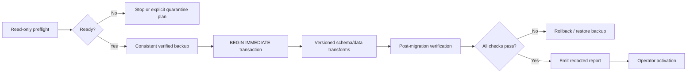

# Schema-v3 Migration

## Status

Schema version 3, strict structural fingerprinting, read-only preflight, verified backup creation, transactional migration, and functional v0.1 quarantine are **implemented in the unreleased v0.3.0a2 development tree**. The commands and report schema remain pre-release interfaces.

```bash
# Existing database; performs checks only and creates no backup.
continuityforge --db project.db migration-check --mode strict

# Existing database; consistent verified backup is mandatory.
continuityforge --db project.db migrate --mode strict
```

Both commands accept `--mode strict|quarantine`. `migrate` refuses a missing database instead of silently creating one. Ordinary read/write commands do not migrate: a recognized v0.1/v0.2 target must pass through the explicit `migration-check` and `migrate` lifecycle.

The alpha admits only the byte-locked, canonical v0.1 schema and canonical supported v0.2 layouts. A v0.1 database with extra alias tables, columns, weakened constraints, indexes, triggers, or views is classified `PARTIAL` and fails closed in both modes; it is not guessed into an active mapping.

## Goals

The v3 migration must be:

- transactional;
- preceded by a verified backup;
- structurally fingerprinted and machine-reportable;
- strict and fail-closed by default;
- reversible through restoration rather than reverse SQL;
- compatible with the frozen v0.1 observable contract and v0.2 provenance model;
- redacted so reports omit complete source bodies by default.

## Non-goals

- inferring missing legacy meaning with an LLM;
- repairing semantic contradictions automatically;
- converting malformed time to unbounded time;
- converting missing access to `agent_accessible`;
- rewriting historical snapshots or evidence coordinates;
- weakening ledger or governance history to make migration pass;
- activating the migrated database before post-verification.

## Migration phases



## Read-only preflight

`migration-check` calls the preflight with backup creation disabled. It must not create or modify the database, start a write transaction, create schema objects, or create a backup. Its report includes:

- detected schema version and supported migration path;
- SQLite integrity and foreign-key findings;
- EventLedger verification result where present;
- snapshot/version chain integrity;
- evidence coordinate, quote/hash, and continuity findings;
- governance status, decision-history, and authority-chain findings;
- malformed access policies and time intervals;
- unknown/partial schema findings and preservation concerns;
- backup destination eligibility;
- a stable structural schema fingerprint;
- stable error, warning, and informational findings.

Preflight applies early resource gates before materializing legacy rows: 1 GiB of database pages/files, 250,000 rows per table, and 1,000,000 total rows. Reaching a limit produces `MIGRATION_RESOURCE_LIMIT`; the report is not silently truncated. Databases within those ceilings can still require substantial peak memory, so large migrations should be rehearsed on a private copy.

The library function is `preflight_migration(database, mode=..., create_backup=...)`. Callers that require a strictly read-only audit must set `create_backup=False`; the CLI does so.

## Backup gate

`migrate` and `migrate_to_v3(...)` admit a v0.1/v0.2 write migration only after creating a consistent SQLite backup, hashing it, opening it independently, verifying `quick_check` and foreign keys, and confirming that both its structural fingerprint and streamed logical-database digest match the locked source connection. Copying only the main database file while a WAL database is live is not sufficient.

The backup is first written to an unpredictable same-directory private temporary file. Its identity, regular-file type, and—on POSIX—`0600` mode are checked before and after verification. Publication never replaces an existing path; numbered regular-file destinations are preserved, while a symbolic-link candidate or an identity change fails closed. The migration begins only after the verified artifact has been flushed and published.

The migration record should bind to backup metadata such as:

- backup artifact path or caller-provided identifier;
- artifact size and SHA-256;
- source structural schema fingerprint;
- source schema version;
- creation time;
- verification result.

Backup files contain complete source content. The migration path creates a restrictive artifact, but the operator remains responsible for directory/ACL protection, external encryption, retention, and off-site handling.

## Transaction boundary

All schema and data mutations occur in one write transaction. A failure leaves the source database at its prior schema version. Version allocation, transformed rows, metadata, and migration-ledger events must not become partially visible.

Post-migration checks run before the database is declared activatable. If an operation requires checks outside the transaction, activation remains a separate operator step and restoration remains available.

## Strict mode

Strict mode stops on any condition that could broaden authority, access, time, or provenance, including:

- malformed or unknown governance status;
- `AUTHORIZED` status without required decision/ledger backing;
- missing evidence for an authoritative record;
- invalid evidence coordinates or snapshot lineage;
- malformed time intervals;
- missing or unknown access policy;
- broken snapshot version/previous links;
- failed ledger verification;
- lossy conversion of an unknown legacy value.

Stopping is preferable to guessing.

## Explicit quarantine mode

Quarantine is optional and must be explicitly selected. v0.3.0a2 applies functional quarantine only while migrating v0.1: each malformed row remains in its renamed legacy table and `legacy_records`, and no active domain row is created for it. Dependent v0.1 rows are quarantined with their invalid snapshot when required.

Malformed v0.2 data remains a blocking error even in quarantine mode. The alpha does not reinterpret or partially map malformed v0.2 provenance.

Implemented v0.1 examples:

- retain the invalid raw row in the renamed legacy table and `legacy_records`;
- omit any active source/snapshot/claim/evidence mapping for that row;
- quarantine a dependent v0.1 claim when its source snapshot is quarantined;
- record the affected table/record ID and stable warning code.

Forbidden examples:

- treating malformed time as unbounded;
- treating missing access as `agent_accessible`;
- fabricating evidence or hashes;
- treating unknown authority as `AUTHORIZED`;
- deleting the original row without an auditable preservation record.

## Preservation requirements

Migration preserves, where present:

- source IDs/keys and continuity;
- immutable snapshot content, hashes, versions, and predecessor links;
- evidence snapshot IDs, spans, quotes, and hashes;
- claim persona, continuity, atomic fields, time, access, confidence, and proposal metadata;
- governance decisions and reviewer/reason/timestamps;
- narrative-event details and evidence;
- ledger entries or a documented versioned ledger transformation;
- complete rows from the admitted canonical v0.1 tables through auditable legacy records.

Unknown/extended v0.1 columns are not an admitted alpha migration shape; preflight classifies that database as partial before any row mapping or backup is attempted.

## Machine-readable report

`MigrationReport.to_dict()` emits stable diagnostic metadata and no complete source bodies. This is the current alpha shape:

```json
{
  "mode": "strict",
  "source": {
    "kind": "v0.2",
    "digest": "STRUCTURAL_SCHEMA_SHA256",
    "user_version": 2,
    "metadata_version": 2,
    "tables": ["claim_proposals", "source_snapshots", "sources"],
    "indexes": [],
    "triggers": []
  },
  "target_version": 3,
  "status": "preflight",
  "is_ready": false,
  "succeeded": false,
  "changed": false,
  "issues": [
    {
      "code": "MIGRATION_CLAIM_STATUS_REPLAY_MISMATCH",
      "message": "claim status differs from immutable decision replay",
      "table": "claim_proposals",
      "record_id": "CLAIM_ID",
      "field": "status",
      "actual": "AUTHORIZED",
      "severity": "error"
    }
  ],
  "checks": {
    "quick_check": "ok",
    "foreign_key_violations": 0,
    "database_bytes": 123456,
    "required_free_bytes": 1048576,
    "available_free_bytes": 999999999,
    "backup_path": null,
    "backup_sha256": null
  },
  "target": null,
  "started_at": "2026-08-19T00:00:00Z",
  "finished_at": "2026-08-19T00:00:01Z",
  "migrated_counts": {},
  "quarantine": {"count": 0, "records": []}
}
```

The `source` and post-migration `target` objects are structural `SchemaFingerprint` values. A successful write report also records the operator-relevant backup path/hash, migrated counts, and quarantined v0.1 record IDs. Inside issue diagnostics, sensitive fields such as quote, content, text, title, summary, details, origin path, and ledger payload serialize only a `{redacted, type, length, sha256}` descriptor; absolute paths and overlong strings in `actual` receive the same treatment. Exact fields remain subject to change until v0.3 is released.

## Post-migration verification

At minimum:

1. schema version and required tables/indexes/triggers;
2. SQLite integrity and foreign keys;
3. source/snapshot/evidence row counts and preservation checks;
4. snapshot hashes and version links;
5. evidence and continuity validation;
6. governance authority-chain verification;
7. EventLedger verification;
8. baseline v0.1 and v0.2 regression suites;
9. representative Memory Pack equivalence;
10. backup restoration drill.

## Failure and recovery

- Preflight failure: no mutation occurred; correct the source or choose an explicit quarantine plan.
- Transaction failure: rollback; verify the original database again.
- Post-verification failure: do not activate; restore the verified backup to a new path.
- Activation error: retain both the failed candidate and backup for audit, then restore through [Backup and Restore](BACKUP_AND_RESTORE.md).

## Compatibility

Migration does not edit the byte-locked v0.1 baseline document or silently redefine v0.2 fields. Any unavoidable behavior change requires a new contract and changelog entry.
