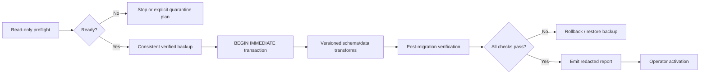

# Schema-v3 Migration

## Status

Schema version 3, strict structural fingerprinting, read-only preflight,
verified backup creation, transactional migration, Source-audit hardening, and
functional v0.1 quarantine are **included in the v0.3.0a4 alpha pre-release**.
The commands are pre-release interfaces; their JSON shape, stream, and
exit semantics are frozen by the [v0.3 CLI contract](CLI_CONTRACT.md).

```bash
# Existing database; performs checks only and creates no backup.
continuityforge --db project.db migration-check --mode strict

# Existing database; consistent verified backup is mandatory.
continuityforge --db project.db migrate --mode strict

# Use only when preflight requires acceptance of current legacy material.
continuityforge --db project.db migration-check --mode strict \
  --attest-current-legacy-material
continuityforge --db project.db migrate --mode strict \
  --attest-current-legacy-material
```

Both commands accept `--mode strict|quarantine` and the boolean opt-in `--attest-current-legacy-material`. `migrate` refuses a missing database instead of silently creating one. Ordinary read/write commands do not migrate: a recognized v0.1/v0.2 target or an exact `v0.3-alpha2`/`v0.3-alpha3` schema must pass through the explicit `migration-check` and `migrate` lifecycle. Library callers use the strict-boolean `attest_current_legacy_material` parameter; non-boolean values are rejected.

The `v0.3-alpha2` compatibility edge is deliberately narrow. It recognizes only structural digest `b0b0314af69f3a4d7051fc28af5bab23ccb5831d0245683b3ad9edc225edc237`, requires a complete matching Source/SourceSnapshot audit before backup, and then installs the later hardening triggers. It never backfills Source audit or appends `schema.migrated`.

The exact `v0.3-alpha3` structural shape is also a named migration source. Its Claim/Event creation entries predate Audit Material v2, so preflight requires current-invocation consent before a backup is published. A successful migration preserves those creation entries, appends bound material attestations, and installs the final material guard in the same transaction. An unknown schema-version-3 shape remains `PARTIAL`.

The alpha admits only the byte-locked, canonical v0.1 schema and canonical supported v0.2 layouts. A v0.1 database with extra alias tables, columns, weakened constraints, indexes, triggers, or views is classified `PARTIAL` and fails closed in both modes; it is not guessed into an active mapping.

## Goals

The v3 migration must be:

- transactional;
- preceded by a verified backup;
- structurally fingerprinted and machine-reportable;
- strict and fail-closed by default;
- reversible through restoration rather than reverse SQL;
- compatible with the frozen v0.1 observable contract and v0.2 provenance model;
- redacted so reports omit complete source bodies by default.

## Non-goals

- inferring missing legacy meaning with an LLM;
- repairing semantic contradictions automatically;
- converting malformed time to unbounded time;
- converting missing access to `agent_accessible`;
- rewriting historical snapshots or evidence coordinates;
- weakening ledger or governance history to make migration pass;
- activating the migrated database before post-verification.

## Migration phases



## Read-only preflight

`migration-check` calls the preflight with backup creation disabled. It must not create or modify the database, start a write transaction, create schema objects, or create a backup. Its report includes:

- detected schema version and supported migration path;
- SQLite integrity and foreign-key findings;
- EventLedger verification result where present;
- Source identity, revision lineage, `updated_at`, and creation-ledger correspondence;
- snapshot/version chain integrity;
- evidence coordinate, quote/hash, and continuity findings;
- governance status, decision-history, and authority-chain findings;
- malformed access policies and time intervals;
- unknown/partial schema findings and preservation concerns;
- backup destination eligibility;
- a stable structural schema fingerprint;
- stable error, warning, and informational findings.

Preflight applies early resource gates before materializing legacy rows: 1 GiB of database pages/files, 250,000 rows per table, and 1,000,000 total rows. Reaching a limit produces `MIGRATION_RESOURCE_LIMIT`; the report is not silently truncated. Databases within those ceilings can still require substantial peak memory, so large migrations should be rehearsed on a private copy.

The library function is `preflight_migration(database, mode=..., create_backup=..., attest_current_legacy_material=...)`. Callers that require a strictly read-only audit must set `create_backup=False`; the CLI does so. With explicit material acceptance, this read-only plan may report `is_ready: true` even though no backup has yet been created.

## Backup gate

`migrate` and `migrate_to_v3(...)` admit a v0.1/v0.2 or exact alpha-schema write migration only after creating a consistent SQLite backup, hashing it, opening it independently, verifying `quick_check` and foreign keys, and confirming that both its structural fingerprint and streamed logical-database digest match the locked source connection. Copying only the main database file while a WAL database is live is not sufficient. If an accepted empty-stream backfill or partial-record attestation is required but the library write path has `create_backup=False`, it fails before mutation with `MIGRATION_MATERIAL_ATTESTATION_REQUIRES_BACKUP`.

The backup is first written to an unpredictable same-directory private temporary file. Its identity, regular-file type, and—on POSIX—`0600` mode are checked before and after verification. Publication never replaces an existing path; numbered regular-file destinations are preserved, while a symbolic-link candidate or an identity change fails closed. The migration begins only after the verified artifact has been flushed and published.

The migration record should bind to backup metadata such as:

- backup artifact path or caller-provided identifier;
- artifact size and SHA-256;
- source structural schema fingerprint;
- source schema version;
- creation time;
- verification result.

Backup files contain complete source content. The migration path creates a restrictive artifact, but the operator remains responsible for directory/ACL protection, external encryption, retention, and off-site handling.

## Transaction boundary

All schema and data mutations occur in one write transaction. A failure leaves the source database at its prior schema version. Version allocation, transformed rows, metadata, and migration-ledger events must not become partially visible.

Post-migration checks run before the database is declared activatable. If an operation requires checks outside the transaction, activation remains a separate operator step and restoration remains available.

## Strict mode

Strict mode stops on any condition that could broaden authority, access, time, or provenance, including:

- malformed or unknown governance status;
- `AUTHORIZED` status without required decision/ledger backing;
- missing evidence for an authoritative record;
- invalid evidence coordinates or snapshot lineage;
- malformed time intervals;
- missing or unknown access policy;
- broken snapshot version/previous links;
- failed ledger verification;
- lossy conversion of an unknown legacy value.

Stopping is preferable to guessing.

## Legacy Audit Material v2 attestation

Audit Material v2 binds every persisted Claim, NarrativeEvent, and Evidence field into canonical aggregate and complete evidence-set SHA-256 digests. New records carry those digests in their trusted creation/checkpoint payloads. Legacy creation payloads that contain only a subset of the persisted aggregate are not silently treated as equivalent.

Canonical v0.1 has no EventLedger material to accept: conversion deterministically generates Material-v2 creation records and requires no attestation flag. For an admitted `v0.2`, `v0.3-alpha2`, or `v0.3-alpha3` database with partial creation material, and for any empty v0.2 Claim/Event audit stream that needs creation backfill, default preflight emits `MIGRATION_LEGACY_MATERIAL_ATTESTATION_REQUIRED`, creates no backup, and performs no write. The operator may repeat `migration-check` and `migrate` with `--attest-current-legacy-material`. The flag means: accept the current complete material under the migration lock as the new audit baseline.

The two accepted legacy write shapes remain distinct:

- an empty v0.2 Claim/Event stream receives a new Material-v2 creation record and **no** material-attestation event;
- an existing partial legacy creation record is preserved and receives one bound material-attestation event.

Accordingly, `MigrationReport.attestations.claims/events` count only the second shape. A migration containing only accepted empty v0.2 backfills reports both counts as zero even though the explicit flag was mandatory.

The write path follows this order:

1. validate the complete current aggregate/evidence material and immutable ledger;
2. create and independently verify the consistent backup;
3. acquire the `BEGIN IMMEDIATE` migration transaction and recheck the source fingerprint;
4. generate Material-v2 creation records for accepted empty v0.2 streams and append one bound attestation for each eligible partial legacy creation entry;
5. install the final material guard and complete post-migration verification;
6. commit all attestation/schema changes together, or roll them all back.

Each attestation payload has exactly six keys: `material_version`, `aggregate_sha256`, `evidence_set_sha256`, `attested_event_type`, `attested_entry_id`, and `migration_source_kind`. A legacy database that already contains any `claim.material_attested` or `narrative_event.material_attested` entry is invalid and blocks migration; a stored assertion cannot substitute for the operator's consent on the current invocation.

The attestation proves which complete material the operator accepted at migration time. It is **not** proof that those values were historically present or correct when the legacy creation event was recorded. Canonical v0.1 conversion creates Material-v2 creation records directly without opt-in. An eligible v0.2 aggregate with an entirely absent Claim/Event audit stream also receives a Material-v2 creation backfill, but only after explicit current-material acceptance and a verified backup. Neither creation-backfill path emits a separate material-attestation event.

`migration-check --attest-current-legacy-material` stops after validating this plan and may report it ready with `backup_path: null`. Readiness is not permission for an actual migration to omit recovery evidence: the write path rechecks the plan and fails with `MIGRATION_MATERIAL_ATTESTATION_REQUIRES_BACKUP` unless a verified backup is present before `BEGIN IMMEDIATE` changes material history.

## Explicit quarantine mode

Quarantine is optional and must be explicitly selected. v0.3.0a4 applies functional quarantine only while migrating v0.1: each malformed row remains in its renamed legacy table and `legacy_records`, and no active domain row is created for it. Dependent v0.1 rows are quarantined with their invalid snapshot when required.

Malformed v0.2 data remains a blocking error even in quarantine mode. The alpha does not reinterpret or partially map malformed v0.2 provenance.

Implemented v0.1 examples:

- retain the invalid raw row in the renamed legacy table and `legacy_records`;
- omit any active source/snapshot/claim/evidence mapping for that row;
- quarantine a dependent v0.1 claim when its source snapshot is quarantined;
- record the affected table/record ID and stable warning code.

Forbidden examples:

- treating malformed time as unbounded;
- treating missing access as `agent_accessible`;
- fabricating evidence or hashes;
- treating unknown authority as `AUTHORIZED`;
- deleting the original row without an auditable preservation record.

## Preservation requirements

Migration preserves, where present:

- source IDs/keys and continuity;
- immutable snapshot content, hashes, versions, and predecessor links;
- evidence snapshot IDs, spans, quotes, and hashes;
- claim persona, continuity, atomic fields, time, access, confidence, and proposal metadata;
- governance decisions and reviewer/reason/timestamps;
- narrative-event details and evidence;
- ledger entries or a documented versioned ledger transformation;
- complete rows from the admitted canonical v0.1 tables through auditable legacy records.

Unknown/extended v0.1 columns are not an admitted alpha migration shape; preflight classifies that database as partial before any row mapping or backup is attempted.

## Machine-readable report

`MigrationReport.to_dict()` emits stable diagnostic metadata and no complete
source bodies. Its formal v0.3 shape is:

```json
{
  "schema": "continuityforge.migration-report/v0.3",
  "mode": "strict",
  "source": {
    "kind": "v0.2",
    "digest": "STRUCTURAL_SCHEMA_SHA256",
    "user_version": 2,
    "metadata_version": 2,
    "tables": ["claim_proposals", "source_snapshots", "sources"],
    "indexes": [],
    "triggers": []
  },
  "target_version": 3,
  "status": "preflight",
  "is_ready": false,
  "succeeded": false,
  "changed": false,
  "issues": [
    {
      "code": "MIGRATION_CLAIM_STATUS_REPLAY_MISMATCH",
      "message": "claim status differs from immutable decision replay",
      "table": "claim_proposals",
      "record_id": "CLAIM_ID",
      "field": "status",
      "actual": "AUTHORIZED",
      "severity": "error"
    }
  ],
  "checks": {
    "quick_check": "ok",
    "foreign_key_violations": 0,
    "database_bytes": 123456,
    "required_free_bytes": 1048576,
    "available_free_bytes": 999999999,
    "backup_path": null,
    "backup_sha256": null
  },
  "target": null,
  "started_at": "2026-08-19T00:00:00Z",
  "finished_at": "2026-08-19T00:00:01Z",
  "migrated_counts": {},
  "attestations": {"material_version": 2, "claims": 0, "events": 0},
  "quarantine": {"count": 0, "records": []}
}
```

The `source` and post-migration `target` objects are structural
`SchemaFingerprint` values. A successful write report also records the
operator-relevant backup path/hash, migrated counts, the `attestations`
object, and quarantined v0.1 record IDs. `attestations.material_version` is `2`
when an admitted legacy source is evaluated against the Material-v2 migration
protocol and otherwise `null`; `claims` and `events` are deterministic counts
of actual planned/written attestation entries (creation backfills are excluded). Inside issue diagnostics,
sensitive fields such as quote, content,
text, title, summary, details, origin path, and ledger payload serialize only a
`{redacted, type, length, sha256}` descriptor; absolute paths and overlong
strings in `actual` receive the same treatment. Machine fields are frozen by
the formal schema; diagnostic prose may be clarified without changing its
stable code.

## Post-migration verification

At minimum:

1. schema version and required tables/indexes/triggers;
2. SQLite integrity and foreign keys;
3. source/snapshot/evidence row counts and preservation checks;
4. snapshot hashes and version links;
5. evidence and continuity validation;
6. governance authority-chain verification;
7. EventLedger verification;
8. Audit Material v2 replay for every Claim/Event aggregate and evidence set;
9. deterministic Source audit replay on every Source and revision;
10. baseline v0.1 and v0.2 regression suites;
11. representative Memory Pack equivalence;
12. backup restoration drill.

Canonical v0.1/v0.2 migrations may create deterministic Source creation audit entries only when that Source's entire historical audit stream is absent. A partial Source stream is corruption and is never completed silently. Canonical v0.1 Claim/Event conversion receives fresh Material-v2 creation payloads without opt-in. Eligible empty v0.2 Claim/Event streams also receive fresh Material-v2 creation payloads, but require explicit current-material acceptance and a verified backup; their `attestations` counts remain zero. Existing partial creation entries require the same acceptance and receive actual attestation events. The `v0.3-alpha2` and `v0.3-alpha3` edges permit no Source-audit backfill.

## Failure and recovery

- Preflight failure: no mutation occurred; correct the source, supply the required explicit acceptance, or choose an explicit quarantine plan.
- Accepted read-only plan but write backup disabled: `MIGRATION_MATERIAL_ATTESTATION_REQUIRES_BACKUP`; no material backfill or attestation occurred.
- Transaction failure: rollback; verify the original database again.
- Post-verification failure: do not activate; restore the verified backup to a new path.
- Activation error: retain both the failed candidate and backup for audit, then restore through [Backup and Restore](BACKUP_AND_RESTORE.md).

## Compatibility

Migration does not edit the byte-locked v0.1 baseline document or silently redefine v0.2 fields. Any unavoidable behavior change requires a new contract and changelog entry.
