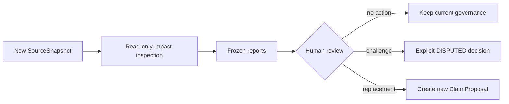

# SourceSnapshot Impact

## Status

- Pure-domain Impact engine: **implemented, unreleased v0.3.0a2**.
- Storage-aware `ReadOnlyProject`, aggregation service, and `source-impact` CLI: **implemented, unreleased v0.3.0a2**.
- Governance mutation from impact: explicitly excluded.

## Purpose

When a logical source gains a new immutable `SourceSnapshot`, existing claim and event evidence still points to the old snapshot. Impact analysis answers a narrow, reproducible question:

> Where, if anywhere, does the old exact evidence quote occur in the target snapshot?

It does not decide whether a revised claim is true, whether the target is canon, or whether governance status should change.

## Trust preconditions

The pure function accepts only:

```python
analyze_evidence_impact(old_evidence, resolved_target_snapshot)
```

`EvidenceRef` contains an old snapshot ID but not logical-source or continuity lineage. Before treating a report as trusted, a storage-aware caller must:

1. resolve the old snapshot;
2. prove the old and target snapshots belong to the requested logical `Source`;
3. prove continuity matches exactly;
4. revalidate the old evidence against the old immutable snapshot;
5. resolve the requested target version or latest snapshot.

A missing or malformed target is a caller error (`ImpactTargetError`), not `INVALID_EVIDENCE`.

## Line and quote semantics

- Source lines use Python `splitlines()` semantics.
- Coordinates are 1-based and end-inclusive.
- Coordinates must be exact built-in `int` values; booleans, strings, `IntEnum`, and integer subclasses are rejected.
- Evidence quotes are cited lines joined with LF.
- CRLF and CR in a supplied quote normalize to LF.
- Spaces, tabs, case, punctuation, and Unicode composition are not normalized.
- An empty quote represents one cited blank line.
- `"\n"` represents two cited blank lines.
- A trailing source newline does not create an extra addressable line.

If `content_hash` is present, it must be a valid SHA-256 digest of the normalized quote. A case-insensitive hexadecimal digest and optional `sha256:` prefix are accepted.

## Outcomes

| Outcome | Deterministic meaning |
|---|---|
| `SAME_POSITION` | At least one exact candidate is the original line span. This wins even if the same text also occurs elsewhere. |
| `EXACT_MOVED_UNIQUE` | Exactly one exact candidate exists, and it is not the original span. |
| `EXACT_MOVED_AMBIGUOUS` | Multiple exact candidates exist, none at the original span. |
| `NO_EXACT_MATCH` | No exact continuous-line candidate exists. |
| `INVALID_EVIDENCE` | Supplied evidence fields cannot form a self-consistent exact-match anchor. This is not a complete historical provenance verdict. |

Classification priority is fixed in the table order.

`NO_EXACT_MATCH` proves only that the old exact quote is absent as one
continuous line sequence in the target snapshot. It does not distinguish an
edit from deletion, truncation, line splitting/merging, or any other cause.
Those explanations may be known from a controlled fixture or human review,
but they are never deterministic Impact outcomes.

## Candidate search

The engine uses Knuth-Morris-Pratt matching over line sequences:

- worst-case search complexity is `O(N + M)` for `N` target lines and `M` quote lines;
- overlapping multi-line candidates are retained;
- candidates are unique and sorted by `(start_line, end_line)`;
- the report stores candidates as a frozen tuple.

For old quote `A\nA` and target lines `A\nA\nA`, candidates are `(1, 2)` and `(2, 3)`.

## Frozen report

An Impact report contains:

- outcome;
- old snapshot ID;
- target snapshot ID and version;
- original line span;
- ordered candidate spans;
- stable reason code and human-readable reason;
- stable error code for `INVALID_EVIDENCE`.

It intentionally omits source bodies and the evidence quote by default.

Example metadata-only representation:

```json
{
  "outcome": "EXACT_MOVED_AMBIGUOUS",
  "old_snapshot_id": "SNAPSHOT_V1",
  "target_snapshot_id": "SNAPSHOT_V2",
  "target_snapshot_version": 2,
  "original_span": {"start_line": 8, "end_line": 8},
  "candidates": [
    {"start_line": 9, "end_line": 9},
    {"start_line": 11, "end_line": 11}
  ],
  "reason_code": "EXACT_AT_MULTIPLE_DIFFERENT_SPANS",
  "error_code": null
}
```

## Invalid anchors

Stable invalid cases include:

- missing evidence or snapshot ID;
- malformed line range;
- missing or non-text quote;
- quote containing unpaired Unicode surrogates;
- quote line count not matching span width;
- malformed or mismatched quote hash.

`INVALID_EVIDENCE` means impact matching cannot use the supplied anchor. It does not prove the old database row was historically invalid; that requires old-snapshot validation.

## Review workflow



No outcome, including `NO_EXACT_MATCH`, automatically changes an `AUTHORIZED` claim. A new source revision may be editorial rather than semantic, and governance remains an explicit human decision.

## Unreleased v0.3.0a2 `source-impact`

`source-impact` is implemented in the development tree. It is not released yet, and its JSON shape remains an alpha interface.

```bash
continuityforge --db project.db source-impact \
  --source-key north-pier-field-log \
  --continuity alpha \
  --from-version 1 \
  --target-version 2
```

Use exactly one of `--source-key` or `--source-id`. `--continuity` is always required. When omitted, `--target-version` defaults to latest and `--from-version` defaults to the target's direct predecessor. `--to-version` is an alias for `--target-version`.

The service:

- select one logical source by `source_key` and continuity;
- select an explicit target version or latest version;
- load only the selected old/target bodies and intermediate lineage metadata;
- gather claim and narrative-event evidence referencing the selected old snapshot;
- recompute endpoint SHA-256/line counts and verify source/continuity lineage;
- verify the global ledger, replay affected claim authority and complete affected-event creation audits, and validate old evidence;
- batch exact-match anchors against the target with a line-token Aho-Corasick scan;
- aggregate counts and per-aggregate reports;
- omit complete source bodies and quotes by default;
- perform no status transition or database mutation.

All endpoint, provenance, claim-authority, event-audit, and matching reads occur inside one pinned SQLite transaction. Event audit is loaded in bounded batches rather than one query per event. If an affected event row, its complete evidence set, or its creation-ledger material diverges, the report fails closed with `EVENT_AUDIT_INVALID`.

### Inspection resource limits

The alpha fails closed instead of truncating a report. Defaults are:

| Boundary | Limit |
|---|---:|
| Source revisions in one lineage | 10,000 |
| Affected evidence rows | 10,000 |
| Total candidate spans in one report | 50,000 |
| Authority records | 100,000 |
| Affected-event audit records | 100,000 |
| Ledger entries | 250,000 |
| Total ledger payload | 64 MiB |
| One ledger payload | 2 MiB |
| Inspection material | 64 MiB |
| One report metadata field | 1,024 UTF-8 bytes |
| Endpoint snapshot | 16 MiB, 200,000 lines, 1 MiB per line |

The pure single-anchor engine separately caps exact candidates at 10,000. The batch matcher caps total pattern lines at 1,000,000. Metadata containing C0/C1, ANSI, bidirectional controls, or unpaired surrogates is rejected before it reaches success JSON.

Current alpha output is explicitly versioned and binds both revisions by complete-content SHA-256 without returning either body:

```json
{
  "schema": "continuityforge.source-impact/v0.3-alpha",
  "report_only": true,
  "source": {
    "source_id": "SOURCE_ID",
    "source_key": "north-pier-field-log",
    "continuity": "alpha"
  },
  "from_snapshot": {
    "snapshot_id": "SNAPSHOT_V1",
    "version": 1,
    "sha256": "SOURCE_BODY_SHA256_V1"
  },
  "to_snapshot": {
    "snapshot_id": "SNAPSHOT_V2",
    "version": 2,
    "sha256": "SOURCE_BODY_SHA256_V2"
  },
  "summary": {
    "affected_evidence": 1,
    "claims": 1,
    "events": 0,
    "outcomes": {
      "SAME_POSITION": 1,
      "EXACT_MOVED_UNIQUE": 0,
      "EXACT_MOVED_AMBIGUOUS": 0,
      "NO_EXACT_MATCH": 0,
      "INVALID_EVIDENCE": 0
    }
  },
  "affected": [
    {
      "aggregate_type": "claim",
      "aggregate_id": "CLAIM_ID",
      "evidence_id": "EVIDENCE_ID",
      "persona_id": "mira",
      "governance_status": "AUTHORIZED",
      "impact": {
        "outcome": "SAME_POSITION",
        "classification": "SAME_POSITION",
        "old_snapshot_id": "SNAPSHOT_V1",
        "target_snapshot_id": "SNAPSHOT_V2",
        "target_snapshot_version": 2,
        "original_span": {"start_line": 2, "end_line": 2},
        "candidates": [{"start_line": 2, "end_line": 2}],
        "reason_code": "EXACT_AT_ORIGINAL_SPAN",
        "reason": "exact quote remains at the original line span",
        "error_code": null
      }
    }
  ]
}
```

Each `affected` item contains aggregate/evidence/persona identifiers, claim governance status (or null for an event), and the nested metadata-only `ImpactReport`. The executable North Pier demo writes the full four-outcome shape.

## North Pier expected cases

The original [North Pier fixtures](../examples/north_pier/README.md) provide:

| Case | v1 span | Expected v2 result |
|---|---:|---|
| Arrival line unchanged | `2-2` | `SAME_POSITION` at `2-2` |
| Register plus locker block shifted | `4-5` | `EXACT_MOVED_UNIQUE` at `5-6` |
| Maintenance note repeated | `8-8` | `EXACT_MOVED_AMBIGUOUS` at `9-9`, `11-11` |
| Old knowledge quote absent in target | `6-6` | `NO_EXACT_MATCH` |

See [Deterministic vs LLM](DETERMINISTIC_VS_LLM.md) for why no model participates in classification.
