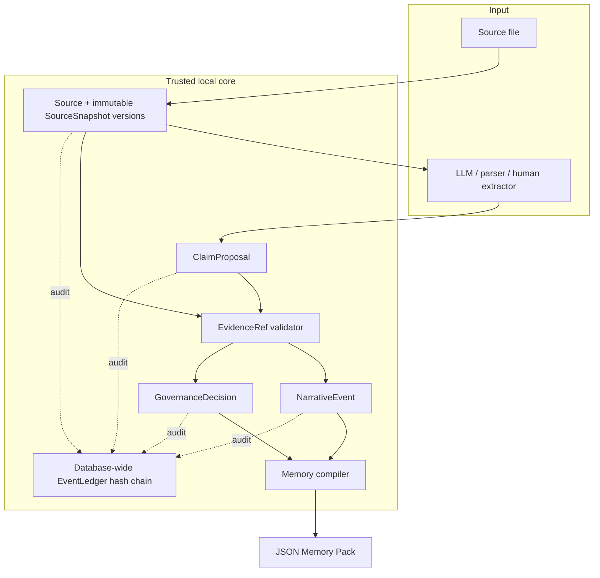
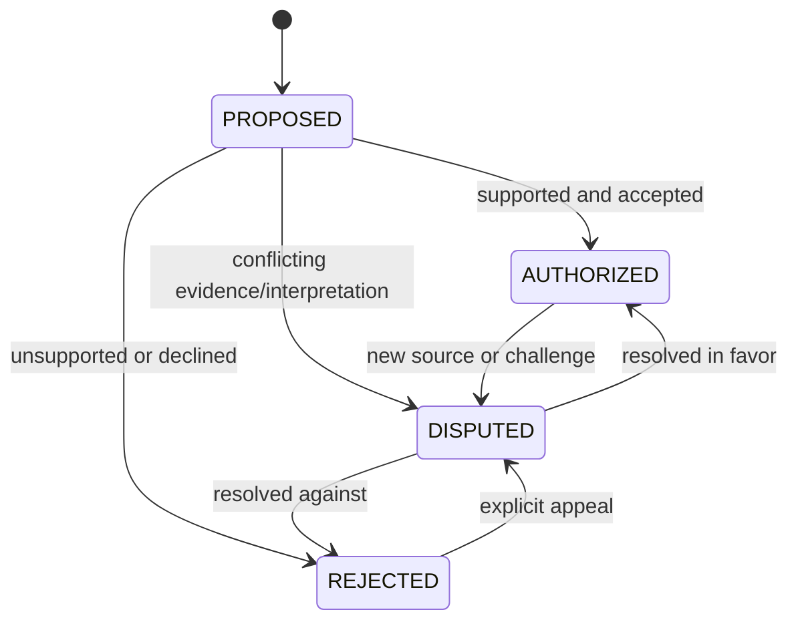

# ContinuityForge v0.2 Design

Status: **implemented architecture target for v0.2**  
Compatibility dependency: [v0.1 Baseline Contract](V0_1_BASELINE.md)

## 1. Goals

v0.2 turns the provenance-aware v0.1 compiler into a governed memory pipeline.

It must:

1. retain immutable revisions of a logical source;
2. bind every claim to verifiable, line-addressed evidence;
3. keep model output at proposal authority;
4. require an explicit governance outcome before compilation;
5. record material changes in a verifiable append-only ledger;
6. preserve persona isolation, continuity isolation, access controls, valid time, knowledge time, and `MemoryCutoff` behavior;
7. remain a dependency-free local core backed by SQLite and exposed through a CLI.

## 2. Non-goals

The trusted core does not:

- call a model provider;
- decide canon from model confidence;
- perform semantic retrieval or embedding storage;
- merge alternate continuities automatically;
- rewrite source files into a normalized “better” form;
- replace a downstream memory store or chat interface;
- provide distributed consensus or multi-node replication.

Provider adapters may create proposal JSON outside the core. They cannot bypass validation and governance.

## 3. Trust model

The system separates five kinds of authority:

| Layer | May do | Must not do |
|---|---|---|
| Source ingestion | Preserve bytes as decoded text and create a snapshot | Rewrite historical snapshots |
| LLM / extractor | Suggest structured claims and evidence coordinates | Mark a claim authoritative |
| Evidence validator | Verify deterministic structural/source facts | Judge narrative truth from plausibility |
| Governance reviewer | Authorize, reject, or dispute with a reason | Erase earlier decisions |
| Compiler | Apply fixed filters and emit eligible memory | Fill gaps by inference |

The core rule is:

```text
proposal authority != source authority != governance authority
```

A fluent proposal with high model confidence remains `PROPOSED` until a recorded review changes its status.

## 4. Architecture



SQLite provides the persistence and transaction boundary. Domain models and validators contain no provider-specific code.

## 5. Domain model

### 5.1 `Source`

A stable logical work inside exactly one continuity.

| Field | Meaning |
|---|---|
| `source_id` | Opaque stable ID |
| `source_key` | Caller-supplied logical key |
| `continuity` | Exact worldline scope |
| `created_at`, `updated_at` | UTC timestamps |

`(source_key, continuity)` identifies the logical source. The same key may exist independently in another continuity.

### 5.2 `SourceSnapshot`

An immutable revision of a `Source`.

| Field | Meaning |
|---|---|
| `snapshot_id` | Opaque snapshot ID |
| `source_id`, `source_key`, `continuity` | Logical-source identity and scope |
| `version` | Monotonic integer beginning at 1 |
| `content_hash` | SHA-256 of the complete decoded content |
| `content` | Preserved source text |
| `media_type`, `origin_path` | Import metadata |
| `previous_snapshot_id` | Direct predecessor or `null` for v1 |
| `line_count` | `splitlines()` addressable-line count |
| `created_at` | UTC creation time |

Snapshots are immutable. A file edit creates a new row; it never updates `content`, `content_hash`, or evidence coordinates on an old row.

### 5.3 `EvidenceRef`

A deterministic citation into one snapshot.

| Field | Meaning |
|---|---|
| `snapshot_id` | Exact cited snapshot |
| `start_line`, `end_line` | 1-based inclusive range |
| `quote` | Selected lines joined with canonical `\n` |
| `content_hash` | SHA-256 of that canonical quote |
| `start_char`, `end_char` | Optional future-compatible character bounds |

The evidence hash is not the whole-snapshot hash. It fingerprints only the selected quote.

### 5.4 `ClaimProposal`

An atomic assertion awaiting or carrying an explicit governance status.

| Field group | Fields |
|---|---|
| Identity/scope | `claim_id`, `persona_id`, `continuity` |
| Human-readable assertion | `text` |
| Conflict key | `subject`, `predicate`, `object_value` |
| World validity | `valid_from`, `valid_to` |
| Persona knowledge | `knowledge_from`, `knowledge_to` |
| Visibility | `access_policy` |
| Governance | `status` |
| Proposal provenance | `confidence`, `proposed_by`, `proposal_model`, `rationale` |
| Audit time | `created_at`, `updated_at` |

Time intervals are half-open: `[from, to)`. A missing endpoint is unbounded.

### 5.5 `GovernanceDecision`

An immutable record of one status transition:

```text
decision_id, claim_id, from_status, to_status,
reviewer, reason, decided_at
```

The claim row may materialize the current status for efficient compilation, but decision history is append-only.

### 5.6 `NarrativeEvent`

A scoped timeline event that may carry structured details independently from an atomic claim:

```text
event_id, persona_id, continuity, event_type,
title, summary, details,
valid_from, valid_to, knowledge_from, knowledge_to,
access_policy, created_at
```

Narrative events carry immutable evidence references using the same snapshot/line semantics as claims. `event-add` persists the semantic event, its evidence rows, and the audit-ledger entry atomically.

Narrative events are an operator-facing input, not an LLM authorization shortcut. A source-extracted model assertion belongs in `ClaimProposal` so that evidence and governance remain mandatory.

### 5.7 `EventLedger`

The EventLedger is a database-wide, append-only hash chain. Each `LedgerEntry` contains:

```text
sequence, entry_id, event_type,
aggregate_type, aggregate_id,
payload, previous_hash, entry_hash, created_at
```

The ledger is an integrity signal, not a blockchain and not a substitute for backups. `ledger-verify` recomputes ordering, predecessor links, and hashes from stored data. A mismatch fails verification instead of silently repairing history.

The first entry uses a genesis predecessor of 64 ASCII zeroes. Entry hashes are SHA-256 over canonical JSON containing:

```text
sequence, entry_id, event_type, aggregate_type, aggregate_id,
payload_json, previous_hash, created_at
```

`payload_json` is itself canonical JSON. SQLite triggers reject ledger `UPDATE` and `DELETE` operations.

## 6. Source versioning algorithm

Ingestion is scoped by `(source_key, continuity)` and serialized by a SQLite write transaction.

```text
1. Decode the supported file without line-ending normalization.
2. Validate format-specific syntax where required (for example JSON syntax).
3. Hash the complete decoded content.
4. Find or create the logical Source.
5. Read its latest SourceSnapshot.
6. If the latest snapshot has identical content, return it with created=false.
7. Otherwise create version latest+1 and link previous_snapshot_id.
8. Append a ledger entry in the same transaction.
```

Important consequences:

- re-importing unchanged current content is idempotent;
- reverting to earlier text can still create a later revision, preserving the revision sequence;
- evidence against v1 remains valid after v2 is added;
- callers must choose whether policy requires the newest version; historical validity is not silently equated with “latest.”

Snapshot and stored-evidence mutation/deletion are rejected by SQLite triggers, so application bugs cannot silently move a citation to different text.

## 7. Evidence validation

For every proposed claim, `EvidenceValidator` applies deterministic checks.

### Required checks

1. At least one evidence reference exists.
2. The referenced snapshot exists.
3. Both line coordinates are integers, not booleans.
4. `1 <= start_line <= end_line <= line_count`.
5. `claim.continuity == snapshot.continuity` exactly.
6. If `quote` is present, it equals the selected snapshot lines joined with `\n`.
7. If `content_hash` is present, it equals SHA-256 of the canonical selected quote.
8. Claim time intervals are well-formed before the claim is eligible for governance or compilation.

### Result shape

Validation produces a report rather than a model-generated explanation:

```text
ValidationReport(
    is_valid: bool,
    issues: list[ValidationIssue]
)
```

Each issue has a stable code and field/evidence context suitable for human output or `validate --json` automation.

The v0.2 evidence-code families are:

```text
EVIDENCE_REQUIRED
CLAIM_CONTINUITY_MISSING
SNAPSHOT_ID_REQUIRED / SNAPSHOT_NOT_FOUND
SNAPSHOT_CONTENT_MISSING / SNAPSHOT_CONTINUITY_MISSING
CONTINUITY_MISMATCH
INVALID_LINE_RANGE / LINE_RANGE_OUT_OF_BOUNDS
SNAPSHOT_LINE_COUNT_MISMATCH
INVALID_QUOTE / QUOTE_MISMATCH
INVALID_CONTENT_HASH / CONTENT_HASH_MISMATCH
```

Evidence validation proves citation integrity and scope. It does not claim that a quote logically entails every nuance in the proposed wording; that is the reviewer's governance responsibility.

## 8. Governance lifecycle



Every transition records a new `GovernanceDecision` and ledger entry. Earlier decisions remain queryable. Reopening a reviewed proposal requires an explicit, reasoned transition to `DISPUTED`; it never rewrites the earlier outcome.

Compiler treatment is simpler than the lifecycle:

- `AUTHORIZED`: potentially eligible;
- `PROPOSED`: excluded;
- `REJECTED`: excluded;
- `DISPUTED`: excluded.

`claim-add` is the human compatibility command. It performs the same evidence validation and then records explicit human authorization atomically. It is not a hidden model bypass.

## 9. Compilation at `MemoryCutoff`

Compilation accepts:

```text
persona_id, continuity, knowledge_at,
optional valid_at, allowed access policies
```

The CLI's `--cutoff` supplies `knowledge_at`. Valid-time filtering is deliberately independent: when `--valid-at` is omitted, `valid_at` remains unset and historical facts are filtered only by knowledge time. Supply `--valid-at` when the pack should represent what is true at a particular world-time instant.

A claim is emitted only if:

```text
status == AUTHORIZED
AND persona_id == requested persona
AND continuity == requested continuity
AND access_policy is allowed (agent output defaults to agent_accessible only)
AND knowledge_at is inside [knowledge_from, knowledge_to)
AND valid_at is inside [valid_from, valid_to), when valid_at is requested
AND evidence remains valid
AND no blocking validator marks the claim ineligible
```

Events use the same persona, continuity, access, and interval semantics. Output retains stable IDs and provenance so a downstream consumer can explain where a memory came from.

Filtering is fail-closed. Missing authorization or malformed boundaries exclude data; they do not trigger an LLM guess.

## 10. CLI surface

```text
continuityforge [--db FILE] ingest PATH [PATH ...] --continuity ID [--source-key KEY]
continuityforge [--db FILE] source-list

continuityforge [--db FILE] claim-propose
  --persona ID --continuity ID --claim TEXT
  [--subject S] [--predicate P] [--object O]
  [--evidence SNAPSHOT:START:END ...]
  [--knowledge-from ISO]
  [--valid-from ISO] [--valid-to ISO] [--knowledge-to ISO]
  [--access POLICY] [--confidence N]
  [--provider NAME] [--model NAME] [--human]

continuityforge [--db FILE] claim-review CLAIM_ID
  --status authorized|rejected|disputed
  --reviewer NAME --reason TEXT

continuityforge [--db FILE] claim-add ...
continuityforge [--db FILE] claim-list ...
continuityforge [--db FILE] event-add
  --persona ID --continuity ID --title TEXT --summary TEXT
  [--evidence SNAPSHOT:START:END ...] [--details JSON] [time/access options]
continuityforge [--db FILE] validate [--json] [--strict-proposals]
continuityforge [--db FILE] compile
  --persona ID --continuity ID --cutoff ISO
  [--valid-at ISO] [--include-human-only] [-o FILE]
continuityforge [--db FILE] ledger-verify
continuityforge [--db FILE] ledger-show
continuityforge [--db FILE] demo [--output-dir DIR] [--reset]
```

Exit-code categories are stable for automation:

| Code | Meaning |
|---:|---|
| `0` | success |
| `2` | command usage error |
| `3` | validation failure |
| `4` | governance failure |
| `5` | ledger verification failure |

## 11. SQLite and atomicity

Schema version 2 adds logical sources, immutable snapshots, evidence references, claim proposals, governance decisions, narrative events, and ledger entries.

Operations that change both a domain aggregate and the ledger must commit atomically:

- snapshot creation and its ledger entry;
- proposal creation plus evidence and its ledger entry;
- governance transition and its ledger entry;
- narrative-event creation, its immutable evidence, and its ledger entry.

Rollback leaves neither half of the operation visible. Foreign keys remain enabled. Version allocation and ledger sequence allocation occur inside a `BEGIN IMMEDIATE` write transaction.

Existing v0.1 databases are migrated transactionally. The migration preserves the renamed source tables, stores every original row (including unknown columns) in `legacy_records`, maps recognizable sources/snapshots/claims/evidence into v0.2, records a migration decision for a legacy claim that was already authoritative, and appends a final `schema.migrated` ledger entry. It must preserve content hashes, source spans, continuity, persona, time bounds, and access policy.

## 12. Validation and release tests

### Baseline regression

- all checks in [V0_1_BASELINE.md](V0_1_BASELINE.md);
- Alpha/Beta isolation;
- January 3 knowledge excluded at a January 2 cutoff;
- human-only data excluded from agent packs.

### Source versioning

- first import creates v1;
- identical current content is idempotent;
- edited content creates v2 linked to v1;
- old evidence still resolves to v1;
- same `source_key` in another continuity has independent history.

### Evidence

- missing snapshot rejected;
- zero, negative, inverted, and out-of-bounds line ranges rejected;
- cross-continuity evidence rejected;
- quote drift rejected;
- evidence-hash drift rejected;
- valid multi-line LF-normalized evidence accepted.

### Governance

- a model proposal starts `PROPOSED`;
- `PROPOSED` does not compile;
- authorization requires valid evidence, reviewer, and reason;
- `REJECTED` and `DISPUTED` do not compile;
- decision history remains append-only.

### Ledger

- a valid chain verifies;
- changed payload, previous hash, sequence, or entry hash is detected;
- a failed domain transaction does not append a ledger entry;
- repeated verification does not mutate the ledger.

### Compiler

- only exact persona/continuity matches compile;
- time intervals use `[from, to)` boundaries;
- only allowed access classes compile;
- output retains claim and evidence IDs;
- a validation failure is fail-closed.

## 13. Extension points

Future adapters can be added around the trusted core:

- provider-specific proposal generators;
- imports from screenplay, EPUB, or chat-export formats;
- exports to Mem0, Letta, vector stores, or persona runtimes;
- reviewer queues and web UIs;
- source-version diff and impacted-claim analysis;
- signed ledger checkpoints.

Each adapter must preserve the v0.1 contract and pass through the v0.2 evidence/governance boundary rather than writing directly to compiled memory.
